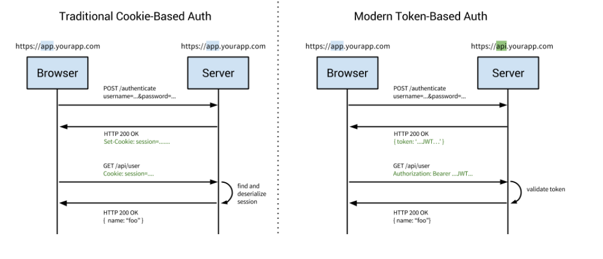
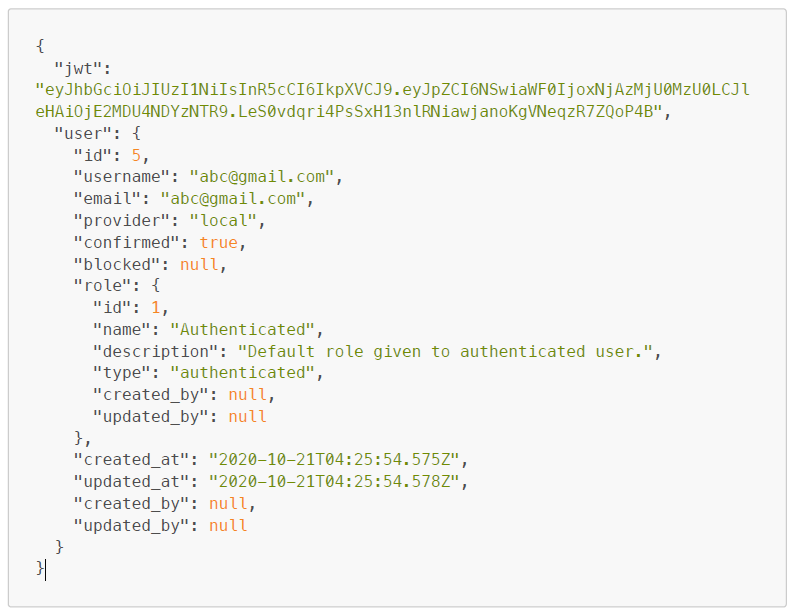

# HShop Project

## Introduction

- A simple project for learning ReactJS
- Features:
  - Register
  - Login/Logout
  - Product list
  - Product detail
  - Pagination
  - Filter (price/category/service...)
  - Add to cart

## Technology

- ReactJS
- Redux-toolkit
- React-hook-form
- Yup
- Axios
- React-router-dom
- MUI
- ...

## Folder structure

```
src
|__ components (shared components between features)
|  |__ Loading
|     |__ index.jsx
|     |__ styles.scss
|
|__ features
|  |__ Todo
|     |__ components (components of feature Todo)
|     |__ pages (pages of feature Todo)
|     |__ index.jsx (entry point of feature Todo)
|
|__ App.js
```

FiltersViewer

```js
const filters = {
  isPromotion: true,
  salePrice_lte: 100,
  salePrice_gte: 100,
};
```

FILTER_LIST

- id: number
- getLabel: (filters) => string
- isActive: (filters) => true/false
- isVisible: (filters) => true/false
- isRemovable: boolean
- onRemove: func
- onToggle: func

```
DetailPage handleSubmit
|__ AddToCartForm (form management)
|  |__ QuantityField
```

/products/:productId --> ProductDescription
/products/:productId/additional --> ProductAdditional
/products/:productId/reviews --> ProductReviews

DetailPage
Click Chon Mua
Open Mini Cart
Go to Cart Page

Cart

- showMiniCart: true / false
- cartItems -> item (product, quantity)

State tính toán phụ thuộc vào state có sẵn

- cartItemsCount
- cartTotal
  --> createSelector()

## Authentication module

- Make an Appbar to insert registration and login links
- Registration feature
- Login feature
- Show different header before and after login
- Save user information to Redux for easy access in many different places
- Automatically attach tokens to requests if logged in



## API login

```
POST /auth/local
```

Sample payload

```js
const payload = {
  identifier: 'abc@gmail.com', // can be either username or email
  password: '123123',
};
```

Sample response


## API register

```
POST /auth/local/register
```

Sample payload

```js
const payload = {
  email: 'abc@gmail.com',
  username: 'abc@gmail.com', // same as email
  password: '123123', // min length 6
  fullName: 'Hien Tran',
};
```

Sample response

